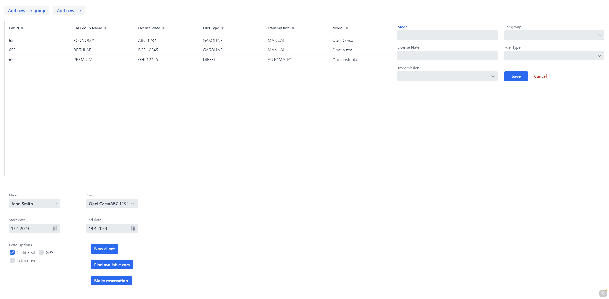

## Kodilla - projekt końcowy
# Car Rental - frontend

### Opis projektu:
Program zarządza danymi w bazie danych wypożyczani samochodów. Przechowuje w badzie danych MySQL dane dotyczące:
- posiadanych samochodów
- grup samochodów
- uszkodzeń samochodów
- klientów
- złożonych rezerwacji
- wypożyczeń

#### Backend
Backend aplikacji znajduje się w repozytorium GitHub pod tym linkiem:
https://github.com/markos02/car-rental

#### Technologie
- Java 17
- Gradle
- Spring Boot 3.0
- Hibernate
- REST API
- MySQL
- JUnit5
- Mockito
- Vaadin (frontend)
- Lombok
- JavaMailSender
- Swagger
- Scheduler

### Uruchomienie aplikacji:
Stworzyć bazę danych MySQL o nazwie car_rental,
utworzyć użytkownika bazy danych o nazwie: kodilla_user , z hasłem: kodilla_password , oraz nadać mu uprawnienia do operacji na bazie.

Plik application.properties zawiera niezbędne klucze i ustawienia do serwisu mailtrap.io oraz zewnętrznych API.

Najpierw należy uruchomić backend znajdujący się pod tym linkem:

https://github.com/markos02/car-rental

uruchamiając metodę 'main' w klasie CarRentalApplication.java. Aplikacja backendowa uruchamia się na porcie 8080. Następnie należy uruchomić frontend aplikacji (metoda main w klasie CarRentalFrontendApplication.java) z tego repozytorium, a w przeglądarce należy przejść po adres: http://localhost:8081.

#### Funkcjonalności frontend

Na dzień dziesiejszy nie wszystkie funkcjonalności zostały zaimplementowane we frontendzie.

Dostępne funkcjonalności:
- pobranie wszystkich samochodów
- dodanie nowego samochodu do bazy
- pobranie wszystkich grup samochodów
- pobranie pojedynczej grupy samochodów
- dodanie nowej grupy samochodów
- pobranie wszystkich klientów
- dodanie nowego klienta

#### Autor
Marcin Kosakowski